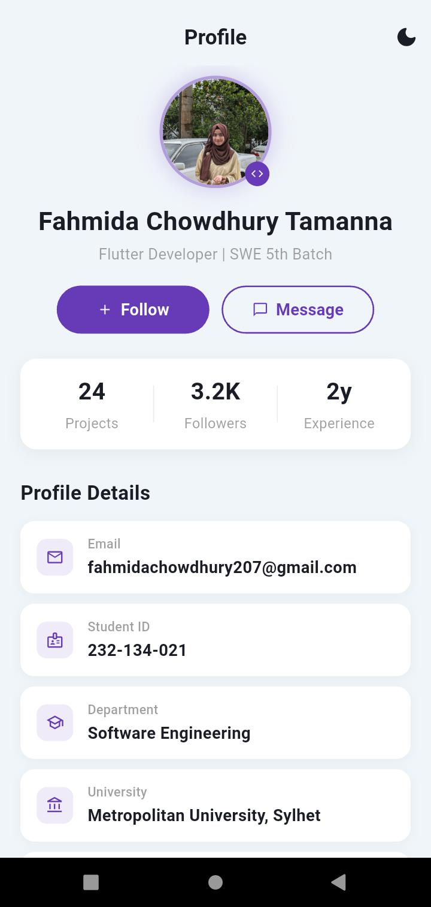
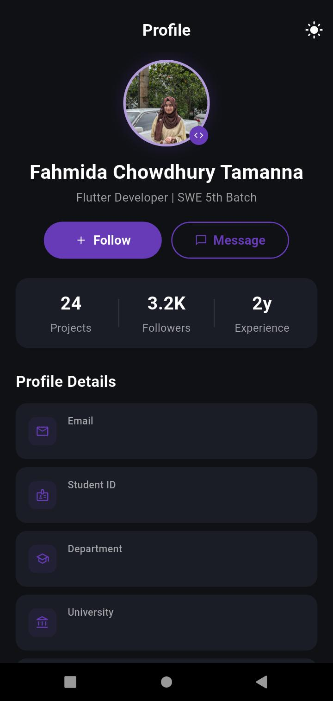

# 🚀 SWE Profile UI (Flutter Assignment)

A modern Flutter-based Profile UI application built for Software Engineering assignment.  
This project demonstrates UI design, state management using setState, and responsive layout.

---

## 📱 Features

- 🌗 Dark & Light Mode Toggle (using setState)
- 👤 Profile Picture using Stack widget
- 📊 Statistics Section (Projects, Followers, Experience)
- 📄 Profile Details (Email, ID, Department, Batch)
- ❤️ Follow / Message / Call Buttons
- 🔄 Follow button toggle (Follow ↔ Following)
- 📝 About Me Section
- 📱 Fully scrollable UI (SingleChildScrollView)

---

## 🧱 Widgets Used

Scaffold, AppBar, Container, Padding, SizedBox, Center, Row, Column, Expanded, Stack, setState

---

## 🎨 UI Highlights

✔ Clean modern design  
✔ Dark & Light theme support  
✔ Responsive layout  
✔ Interactive buttons  

---

## 📸 Screenshots

### 🌞 Light Mode


### 🌙 Dark Mode


---

## 🚀 How to Run

```bash
flutter pub get
flutter run
